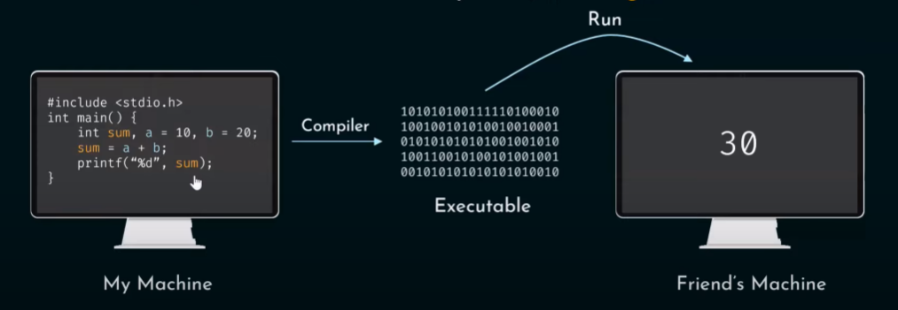
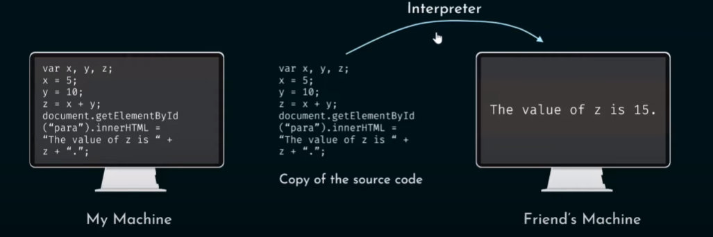
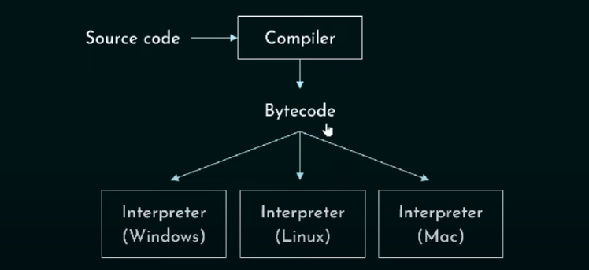
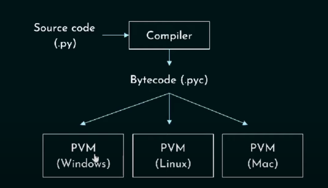
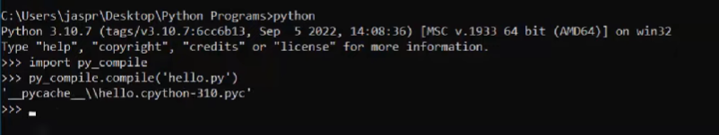

# BASICS

1. **What is Translator?**
- A translator is a person or tool that converts text or speech from one language to another.

1. **Why do we need translator?**
- Computer program written using high-level language.
- Only humans are capable to understand high-level language.
- **Translator** - converts high level language code to the binary language code which machines can understand.

1. **How many types of translators? What are they?**
- 2 types of translators
    - Compiler
    - Interpretor

## Compiler

1. **What is compiler?**
- Compiler is **complex piece of software** whose job is to **convert** *source code* (i.e) *human understandable* to *machine understandable code* (i.e) *binary code* in _**one go**_.

- Before running a code we need to compile.
- After compiled, the compiler translates the source code to machine executable code.
- The executable code will **run** on the machine.
- If we compile thr code in windows machine then the executable file extention would be **.exe**
- Also we will get *object file*. (need not to worry)

**Note**: C is compiled programming language. 

## Interpreter
1. **What is interpreter?**
- Interpreter is a software program written to translate *source code* (i.e) *human understandable* to *machine understandable code* (i.e) *binary code* but it does that by **_line by line_**.

- Convert each line one by one to machine code on the fly (at run time).

- Machine 2 also required machine code.
- We don't get executable in response.

**Note**: JS is interpreted programming language. 

## Compiler vs Interpreter

**Compiler**: Translate the source code to machine code in one go.
**Interpreter**: Translate the source code to machine code line by line. It never generates the executable.

## Pros of compiled anguages
- Private code - source code is safe.
- Faster Execution (Compile once run multiple times).
- Fully optimized. (Optimized according to our CPU).

## Cons of compiled languages
- No portability (executable is capable to run in similar type of platform - Windows machine alone or MAC alone or Linux machine alone based on which platform it is compiled).
- Extra compilation step (when we change the source code).

## Pros of interpreted languages
- Portable.
- Easy to debug.
 
## Cons of interpreted languages
- Required interpreter.
- Slower.
- Public code. (no executable)

## Hybrid Approach
- Involves best of Compiler and interpreter.
- Combination of both.
- Code privacy form compilation and portability from interpretaion.
- Interpreter must be installed.

### **_Eg_**: 
- **Compiled**: C, C++, etc.,
- **Interpreted**: JS, PHP, etc.,
- **Hybrid**: Java, C#, etc.,

### Is pthon interpreted or compiled language?
- Python is both compiled and interpreted language. (HYBRID)
- Interpreter is a part of PVM

**_Eg_**: **Generation Example**

